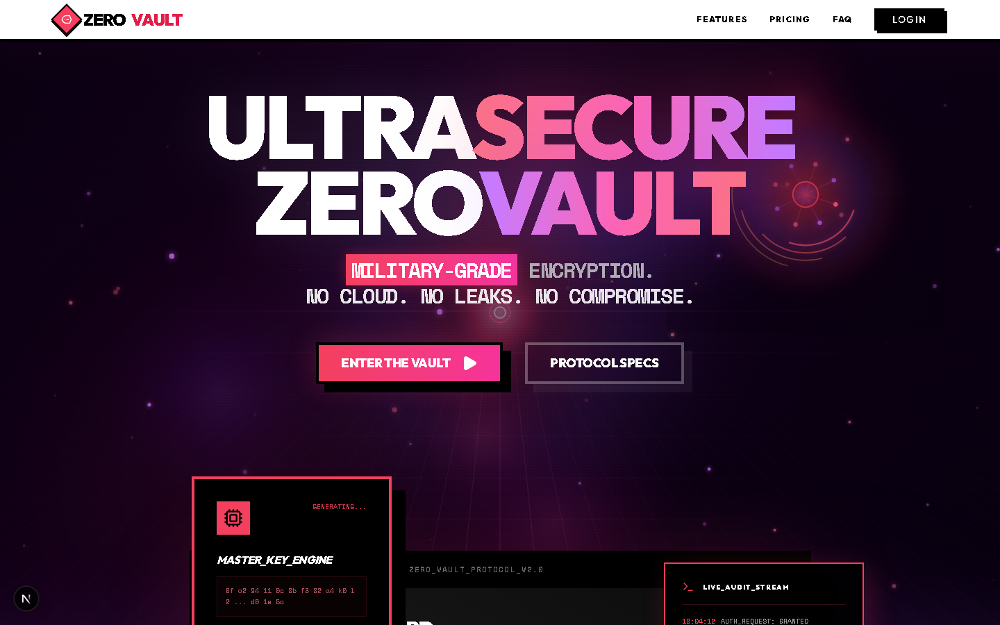
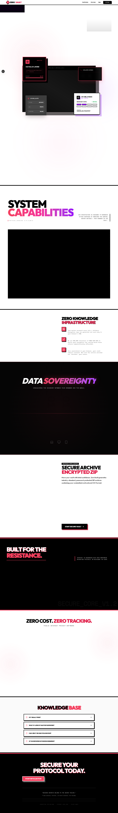
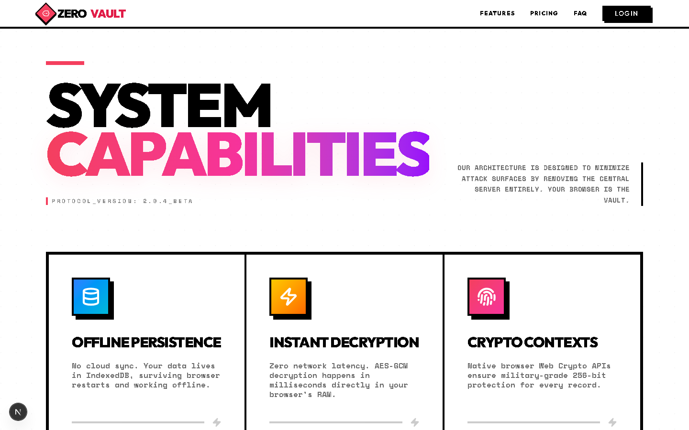
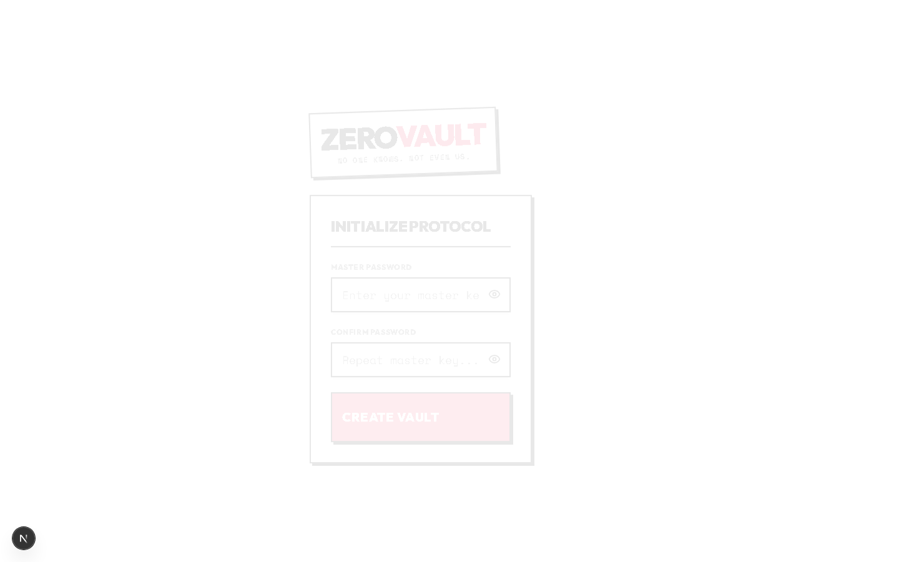
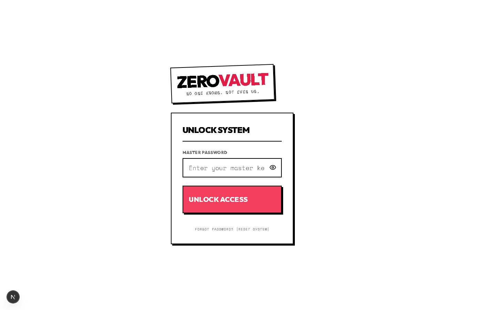
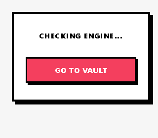
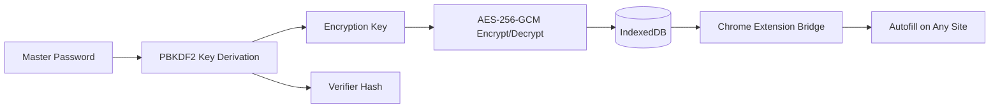

<p align="center">
  
</p>

<h1 align="center">ZeroVault</h1>

<p align="center">
  <strong>Privacy-first, local-only password management — your data never leaves your device.</strong>
</p>

<p align="center">
  <a href="https://github.com/OneforAll-Deku/Zero-Vault">GitHub</a> ·
  <a href="#-getting-started">Quick Start</a> ·
  <a href="#-screenshots">Screenshots</a> ·
  <a href="#-security">Security</a>
</p>

---

**ZeroVault** is a zero-knowledge password manager that combines a retro-styled Next.js web dashboard with a Chrome extension for seamless autofill. All encryption and decryption happen locally in your browser — no cloud servers, no tracking, no compromises.

| | |
|---|---|
| **Encryption** | AES-256-GCM with PBKDF2 key derivation |
| **Storage** | IndexedDB (local-first, offline-capable) |
| **Extension** | Manifest V3 with secure localhost bridge |
| **License** | MIT |

---

## 📸 Screenshots

### Landing Page

A bold, brutalist landing page that showcases the vault's security-first philosophy.

<p align="center">
  
</p>

<p align="center">
  
</p>

### System Capabilities

Core features — offline persistence, instant decryption, and native Web Crypto.

<p align="center">
  
</p>

### Authentication

Create a new vault or unlock an existing one with your master password.

<table>
  <tr>
    <td align="center">
      <b>Create Vault</b><br/>
      
    </td>
    <td align="center">
      <b>Unlock Vault</b><br/>
      
    </td>
  </tr>
</table>

### Browser Extension

A lightweight Chrome extension that bridges your vault to any website for smart autofill.

<p align="center">
  
</p>

---

## ✨ Features

- **Zero-Knowledge Architecture** — Encryption and decryption happen entirely in your browser. We never see your master password or vault data.
- **Retro Brutalist UI** — High-contrast, distinctive design built with a custom RetroUI component system.
- **Smart Autofill** — The extension detects login fields and matches credentials by domain.
- **Security Audit** — Built-in vault health scanner for weak, reused, or aging passwords.
- **Encrypted Backups** — Export and import your vault as an encrypted JSON blob or ZIP archive.
- **Session Persistence** — Extension stays unlocked while your browser is open via `chrome.storage.session`.
- **Favorites & Tags** — Organize credentials with stars, tags, and trash recovery.
- **Secure Notes** — Store encrypted notes alongside passwords in the same vault.

---

## 🏗️ Project Structure

```
Zero-Vault/
├── zero-vault/          # Next.js web console (dashboard + landing)
│   ├── src/app/         # Pages: landing, auth, dashboard
│   ├── src/lib/         # Crypto, extension bridge
│   └── src/components/  # RetroUI + landing sections
├── extension/           # Chrome extension (Manifest V3)
│   ├── background.js    # Service worker
│   ├── content.js       # Autofill injection
│   └── popup.js         # Extension popup UI
├── zero-sync-server/    # Optional sync server (WIP)
└── docs/screenshots/    # README screenshots
```

### How It Works



---

## 🚀 Getting Started

### Prerequisites

- [Node.js](https://nodejs.org/) 18+
- [Google Chrome](https://www.google.com/chrome/) (for the extension)

### 1. Run the Web Vault

```bash
cd zero-vault
npm install
npm run dev
```

Open [http://localhost:3000](http://localhost:3000) and create your vault with a strong master password.

### 2. Install the Browser Extension

1. Open Chrome and go to `chrome://extensions`
2. Enable **Developer mode** (top-right toggle)
3. Click **Load unpacked** and select the `extension/` folder
4. Copy the **Extension ID** from the extension card

### 3. Connect Vault ↔ Extension

1. Open `zero-vault/src/lib/extensionBridge.ts`
2. Set `EXTENSION_ID` to the ID you copied
3. Refresh the vault page and log in — the extension will sync automatically

### 4. Docker (Optional)

```bash
cd zero-vault
docker build -t zero-vault .
docker run -p 3000:3000 zero-vault
```

---

## 🔒 Security

| Layer | Detail |
|-------|--------|
| **Algorithm** | AES-256-GCM (authenticated encryption) |
| **Key Derivation** | PBKDF2 with 600,000 iterations + unique local salt |
| **Storage** | W3C IndexedDB — data stays on your machine |
| **Extension Bridge** | Cross-extension messaging restricted to verified localhost origins |
| **Master Password** | Never stored; only a verifier hash is kept locally |

> **Important:** If you lose your master password, your data is permanently unrecoverable. This is intentional — there are no backdoors and no password-reset servers.

---

## 🛠️ Tech Stack

| Category | Technologies |
|----------|-------------|
| **Frontend** | Next.js 16, React 19, Tailwind CSS 4 |
| **Animation** | Framer Motion |
| **Encryption** | Web Crypto API (SubtleCrypto) |
| **State** | Zustand |
| **Database** | IndexedDB via `idb` |
| **Extension** | Manifest V3, Shadow DOM, Content Scripts |
| **Icons** | Lucide React |

---

## 🗺️ Roadmap

- [ ] Self-hosted Docker Compose with Caddy SSL
- [ ] Argon2id key derivation
- [ ] Multi-device encrypted sync
- [ ] Multi-user vault sharing
- [ ] Firefox extension support

See [`zero-vault/SELF_HOSTED_PLAN.md`](zero-vault/SELF_HOSTED_PLAN.md) for the full self-hosting architecture plan.

---

## 🤝 Contributing

Contributions are welcome! Feel free to open an issue or submit a pull request.

1. Fork the repository
2. Create a feature branch (`git checkout -b feature/my-feature`)
3. Commit your changes
4. Push and open a PR

---

## 📜 License

MIT © [OneforAll-Deku](https://github.com/OneforAll-Deku)

---

<p align="center">
  <sub>Built with privacy in mind. No cloud. No leaks. No compromise.</sub>
</p>
